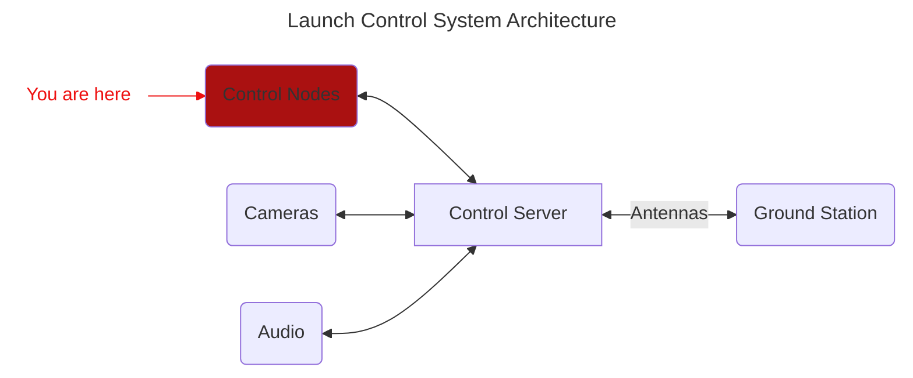

# Project name here (undecided)
This repository contains the ESP32 firmware for Launch Control's control nodes. These nodes function as the interface between remote commands and the launch hardware.

Control nodes are not autonomous, and require commands from the external control server to operate. Control nodes can aqcuire sensor readings and actuate controls remotely. The firmware uses two JSON configuration files to generate initialization code for different board configurations during the build process, allowing sensor and control configurations to be implemented for different hardware setups.



## IDE Setup
Installation instructions for ESP-IDF in VSCode can be found at [ESP-IDF Install](https://www.notion.so/qret-ohyeah/ESP-IDF-Setup-310401792b9b8084918acd9994c0cd01).
It is recommended to install ESP-IDF in WSL if on Windows, as the Linux version is more stable.

## Configuration files
Board configurations are managed in two files, esp_config.json and esp_mapping.json.
- esp_mapping.json: Contains all hardware GPIO and ADC configurations, which is board specific. This should only need to be set once per board. For ease of use, connections from esp_mapping.json should be labelled the same as the silkscreen labels on the board.
- esp_config.json: Contails all sensor and control configs. Sensor and control configs reference esp_mapping.json to get their hardware configurations. To set up a new sensor or control, set the sensor_index or control_index field to the corresponding connection name from esp_mapping.json, and fill out any other relevant fields.

### esp_mapping.json example:
```json
{
    "i2c_bus": {
        "sda_pin": 9,
        "scl_pin": 10,
        "frequency_Hz": 100000
    },
    "wifi_indicator_pin": 1,

    "ADC_map": {
        "ADC1": {
            "addr": 64,
            "DRDY_pin": 21
        }
    },
    "sensor_map": {
        "TC1": {
            "ADC_index": "ADC1",
            "p_pin": 3,
            "n_pin": 2
        }
    },
    "control_map": {
        "SAFE_24V_CTL": {
            "pin": 4
        }
}
```

### esp_config.json example:
```json
{
    "device_name": "PANDA-V3",
    "device_type": "Sensor Monitor",

    "sensor_info": {
        "thermocouple": {
            "TCRun": {
                "sensor_index": "TC1",
                "type" : "K",
                "unit" : "C"
            }
        }
    },

    "controls": {
        "Safe24": {
            "control_index": "SAFE_24V_CTL",
            "default_state" : "OPEN",
            "type" : "relay"
        }
}
```

## Build instructions
To set WiFi credentials, first open the ESP-IDF terminal and run:
```bash
idf.py menuconfig
```
Scroll down, select the WiFi credentials option, set your credentials, and save by pressing S.

If using a chip other than the ESP32-S3, run this command to set the version:
```bash
idf.py set-target <your-model>
```

To build and flash the project to your ESP32, run:
```bash
idf.py build
idf.py flash
```

To view debug logs, run:
```bash
idf.py monitor
```
This will restart the chip. Debug log levels can be set in menuconfig, under Component config->Log->Log level.